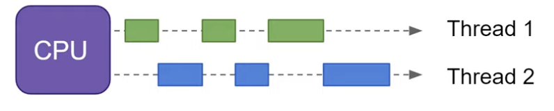

# 동시성 (Concurrency)

- 하나의 프로세서가 겉보기에 동시에 둘 이상의 작업을 진행하는 방법을 의미한다.  
- 싱글 코어에서 멀티 스레드를 동작시키기 위한 방식으로 여러 스레드들을 번갈아가면서 실행하는 방식(Context switching을 수반)이다.
- __논리적__ 인 개념, 논리적으로 동시에 실행

  

  

# 병렬성 (Parralelism)

- 여러 작업을 여러 대의 프로세서가 각각 하나씩 맡아서 수행하는 것.

- 멀티코어에서 멀티스레드를 동작시키는 방식으로 여러 스레드들을 동시에 실행한다.
- __물리적인__ 개념, 물리적으로 동시에 실행

 

 
 

# 장단점들

- **병렬성이 멀티 코어 + 멀티 스레드 작업이라 항상 더 좋을 것 같지만, 동시성으로 접근하는게 좋은 경우**도 있음
  - ex. **네트워크 통신, 파일 저장 및 로드 등의 I/O 작업은 CPU가 거의 일을 하지 않고** 요청 후 **응답이 올 때까지 대기**상태에 있게됨. 이때 **한 개의 CPU가 I/O 요청 후 기다리는 동안 다른 작업을 처리하도록 하면 효율적**

- 물론 병렬작업으로 여러 CPU가 동시에 다수 I/O 작업을 실행하게 할 수 있으나, 물리적인 CPU의 경우 개수 제한이 있기 때문에 동시성으로 접근하는 것이 좋음

- 동시성과 병렬성을 혼용해서 처리하는 경우도 있음

- **동시성**은 작업이 바뀔 때 **문맥 교환(Context Switching)이 발생**하고, 동시 작업이 너무 많다면 **문맥 교환의 오버헤드로 인해** 싱글 코어에서 싱글 스레드로 작업하는 것이 더 빠를 수 있음

- 코어가 N배로 늘어난다고 하더라도 성능이 N배로 늘어나는 것은 아님(암달의 법칙) : **프로그램의 모든 부분을 Parallel 하게 작성할 수 없고 반드시 Sequential하게 동작해야 하는 부분들이 존재**함

출처: https://mentha2.tistory.com/245 [행궁동 데이터 엔지니어]

 
 

# 정리

| 동시성(Concurrency)                        | 병렬성(Paralleism)                         |
| :----------------------------------------- | ------------------------------------------ |
| 동시에 실행되는 것처럼  보이는 것          | 실제로 동시에 여러 작업이 처리되는 것      |
| 싱글 코어에서 멀티스레드를 동작시키는 방식 | 멀티 코어에서 멀티스레드를 동작시키는 방식 |
| 한번에 많은 것을 처리                      | 한번에 많은 일을 처리                      |
| 논리적인 개념                              | 물리적인 개념                              |

 
 
 

---

References

https://seamless.tistory.com/42

https://mentha2.tistory.com/245