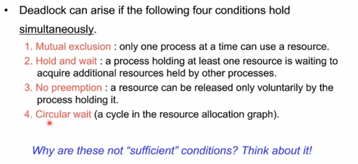
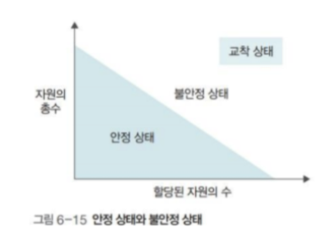

# Race Condition

<aside> 💡 2 개 이상의 프로세스가 공유 자원을 병행적으로 읽거나 쓰는 상황을 말한다.

</aside>

- 공유 자원 접근 순서에 따라 실행 결과가 달라질 수 있다.
- 둘 이상의 입력이나 조작이 동시에 일어나 의도하지 않은 결과가 나오는 경우
- 동시 접근 시 자료의 일관성을 해치는 결과가 나오는 경우
- 경쟁상태도 교착상태의 종류 중 하나이다.

# Dead Lock

<aside> 💡 2개 이상의 프로세스가 다른 프로세스의 작업이 끝나기만을 기다리며 작업을 더 이상 진행하지 못하는 상태를 교착상태라고 한다

</aside>

- 시스템의 제한된 리소스에서 리소스를 원하는 프로세서가 두개 이상일  때
- 교착상태는 시스템 자원(주변장치도 포함), 공유 변수(또는 파일), 응용프로그램(ex database)등을 사용할 때 발생할 수 있다.
- 두 개 이상의 프로세스 혹은 스레드가 서로가 가진 리소스를 기다리는 상태

# 임계영역 (Critical Section)

<aside> 💡 공유 자원 접근 순서에 따라 실행 결과가 달라지는 프로그램의 영역을 임계구역이라고 한다. 즉 공유자원에 접근하는 프로세스 내부의 코드 영역을 지칭한다.

</aside>

임계구역에서는 프로세스들이 동시에 작업하면 안된다. 어떤 프로세스가 임계구역에 들어가면 다른 프로세스는 임계구역 밖에서 기다려야 하며 임계구역의 프로세스가 나와야 들어갈 수 있다.

```
교착 상태가 발생할 수 있는 영역
```

# 데드락 발생의 조건들

데드락이 발생하기 위해서 반드시 만족해야하는 조건. 데드락의 발생은 위 네가지 조건을 동시에 만족하면 일어날 수 있다. (네가지 조건은 필요조건이다)



- mutual exclusion: 사용하려는 리소스가 공유해서 사용할 수 없는 리소스다. (한번에 한 프로세스만 한 리소스 자원을 사용가능) 여기서 리소스는 크리티컬 섹션, 락 일수도 있으며 컴퓨터를 구성하는 CPU, 메모리 SSD 모니터 등 도 포함된다.
- Hold and wait: 어떤 프로세스가 이미 하나 이상의 리소스를 할당받은 상태에서(hold), 작업을 진행하기 위해 다른 프로세스가 사용하고 있는 리소스를 추가로 기다린다(wait)
- No preemption: 어떤 프로세스가 리소스를 쓰고 있을 때 강제로 뺏을 수 없다. 즉 리소스 반환은 오직 그 리소스를 취득한 프로세스만 할 수 있다.
- Circular wait: 프로세스들이 순환 형태로 서로의 리소스를 기다린다.

네가지 조건을 관점에 따라 분류하면 다음과 같다.

자원의 특징 : 상호배제(mutual exclusive) 와 비선점(no preemtion) whrjs

프로세스의 행위 : 점유와 대기(hold and wait)과 원형 대기 조건(circular wait)

# 교착 상태의 해결 방법

교착상태의 해결 방법은 예방, 회피, 검출 이 있으며 추가적으로 교착 상태가 발견된 후에 자원을 회복 하는 방법도 있다.

예방: 교착 상태를 유발하는 네 가지 조건을 무력화한다.

회피 : 교착상태가 발생하지 않는 수준으로 자원을 할당한다.

검출: 자원 할당 그래프를 사용하여 교착상태를 발견한다.

회복: 교착상태를 검출한 후 해결한다.

## 1. 데드락 예방

네 가지 조건 중 하나가 충족되지 않게 시스템을 디자인하는 해결책이다.

### #1 Mutual Exclusion 조건

해결책 : 리소스를 공유 가능하게 한다

단점

- 현실적으로 불가능하다.

- 리소스의 특성상 mutual exclusion이 반드시 보장되어야 하는 리소스가 존재하기 때문에 이 방법은 사실상 불가능하다.  

  

### #2 Hold and wait 조건

**해결책:** 사용할 리소스들을 모두 획득한 뒤에만 작업을 시작하는 조건과 리소스를 전혀 가지지 않은 상태에서만 리소스 요청을 가능하게 하는 조건을 건다. ‘전부 할당하거나 아니면 아예 할당하지 않는 all or nothing‘ 방법.

단점

- 프로세스가 자신이 사용하는 혹은 사용할 모든 자원을 확실히 알기 어렵다.

- 리소스 사용 효율이 떨어진다

  프로세스가 미래에 사용할 자원까지 미리 선점해버리기 때문에 그 자원을 필요로하는 다른 프로세스의 작업이 진행될 수 없다. 당장 필요하지 않은 자원을 잡고 있는 것은 매우 비효율적이다.

- 많은 자원을 사용하는 프로세스는 스케줄링의 관점에서 적은 자원을 사용하는 프로세스보다 불리하다. 많은 자원을 사용하는 프로세스는 우선순위에서 밀려나 starvation하게 될 확률이 높다.

- 결국 일괄 작업 방식으로 동작하게 된다.

### #3 No Preemption 조건

**해결책**: 모든 자원을 preemtion 할 수 있도록 만든다.

CPU에서 컨텍스트 스위치의 개념과 비슷하다. 한 프로세스가 timeslice를 다 썼을 때, 대기중인 프로세스가 있다면 다음 프로세스에게 CPU 점유권을 넘긴다.

모니터의 개념과도 비슷하다. 크리티컬 섹션이라는 리소스를 확보하고 나서 그 안에 동작하다가 특정 조건이 만족될때까지 기다려야한다면 자신이 쥐고 있던 락을  반환해서 다른 누군가가 임계영역에 들어올 수 있도록 허용한다.

단점

- 사실상 시스템의 모든 자원을 빼앗을 수 있도록 할 순 없다(크리티컬 섹션, 특수 목적 자원 등)
- 자원을 빼앗을 수 있게 한다 해도, 어떤 기준으로 빼앗울 지, 빼앗은 시간 중 얼마나 사용할 수 있게 할지 등 고려해야할 사항이 너무 많다. 
- 현실적으로 구현할 때 수반되는 다양한 문제점들이 존재하고 구현이 거의 불가능하다.(starvation, 우선순위 등)

### #4 Circular wait 조건

**헤결책** : 모든 리소스에 순서 체계를 부여해서 오름차순으로 리소스를 요청하게 구현.

순서체계가 존재하기 때문에 리소스 할당의 순환이 발생하지 않게 되므로 데드락을 예방할 수 있다.

예를 들어 key가 작은 자원을 점유한 상태에서 큰 key의 자원을 점유하는 것은 가능하지만 그 반대는 불가능하게 할 수 있다.

현실적으로 가장 많이 활용되는 방식이라고 한다.

단점

- 프로세스 작업 진행에 유연성이 떨어진다.

  예를 들면, 마우스가 1번 키보드가 2번, 프린터가 3번이라 하자. 사용자 입장에서는 키보드나 프린터를 쓰고 나서는 마우스를 사용할 수 없게 된다.

- 자원의 순서체계를 어떤 식으로 부여하는가가 문제이다

  순위가 높은 번호의 자원을 사용한 후 작은 순위의 자원을 사용할 수 없기 때문에 순서체계를 부여할 때 매우 신중해야한다. 자원에 어떻게 번호를 붙이던 간에 자원 사용에 제약이 따라오게 된다.

- 즉 프로세스의 작업 효율을 저하시키고, 자원을 낭비하게 된다.

### 정리

전체적으로 데드락 예방은 일단 구현이 불가능에 가깝다. 설사 구현을 한다 하더라도 새로운 문제들이 야기될 수 있으며 자원 활용의 효율성을 저하시키는 문제가 여전히 존재하기에 거의 쓰이지 않는 전략이다.

## 2. 데드락 회피

앞선  데드락 예방은 시스템 레벨에서 조건을 무력화시키는 방안이었다. 하지만 데드락 회피  방법은 실행 환경에서 추가적인 정보를 활용해서 데드락이 발생할 것 같은 상황을 회피하는 것이다.

여기서 실행환경에서의 정보라 함은, 동작하고 있는 운영체제에서 특정 시점에 사용 가능한 리소스들, 할당된 리소스들, 미래에 존재할 리소스 요청이나 반환 등과 같은 정보를 의미한다.

------

안정상태와 불안정 상태



- 데드락 회피의 핵심은 자원의 총 수와 현재 할당된 자원의 수를 기준으로 시스템을 안정상태와 불안정 상태로 나누고 시스템이 안정상태를 유지하도록 자원을 할당하는 것이다.
- 할당된 자원이 적으면 안정상태쪽으로 가고, 할당된 자원 수가 커질 수록 불안정 상태가 커진다.
- 교착상태는 불안정 상태의 일부분일 뿐이다. 불안정 상태라고 해서 반드시 교착상태가 일어나는 것은 아니다.

교착상태 회피는 안정 상태를 유지할 수 있는 범위 내에서 자원을 할당함으로써 교착상태를 피한다.

------

데드락 회피를 구현하는 가장 대표적인 방법은 `banker's algorithm` 이다.

안정상태와 불안정 상태를 구현한 것으로, 리소스 요청을 허락했을 때 데드락이 발생할 가능성이 있으면, 즉 불안정 상태가 된다면, 요청을 거절하는 알고리즘이다.

### 데드락 회피의 문제점들

- 프로세스가 자신이 사용할 모든 자원을 미리 시스템에게 선언해야하는데 현실적으로 정확한 선언이 불가능하다.
- banker algorithm의 전제는 시스템 전체의 자원수가 고정적이어야 한다는 점이다.  하지만 현실에서는 실행환경에서 끊임없이 사용가능한 자원이 추가되기도 없어진다는 문제가 있다
- 자원을 낭비할 수 밖에 없다. 모든 불안정 상태가 데드락을 일으키는 것이 아닌데도 자원을 할당할 수 없다. 실제로 데드락이 발생하지 않는데도 발생할 것이라고 단순히 ‘예측’ 하기 때문에 자원할당이 비효율적일 수 밖에 없다.

## 3. 데드락 검출과 회복

이 방법은 일단 데드락을 허용하고, 데드락이 발생하면 복구한다는 전략이다.

데드락 해결책 전략 중 가장 현실적인 방법으로 대부분의 시중 general purpose os에서 채택한 방법이라고 한다.

### 검출 전략

- 타임아웃: 일정기간 작업이 진행되지 않는 프로세스를 데드락에 빠졌다고 간주하는 방법이다. 실제 데드락이 아닐수도 있고 네트워크와 같은 시스템에서는 어울리지 않는 방법이라는 문제가 있다. 하지만 실제로 많이 쓰이는 방법이라고 한다.

- RAG(Resource Allocation Graph) 를 이용한  방법

  RAG를 이용하여 교착상태를 정확히 파악하는 방법이다. 정확히 모든 자원과 프로세스를 그래프로 감시하고 트랙하기 때문에 오버헤드가 발생하는 단점이 있지만 매우 정확한 검출이 장점이다.


### 회복 전략

- 교착 상태를 일으킨 프로세스를 모두 종료하기
- 교착 상태를 일으킨 프로세스 중 우선순위 체계를 부여해서 순서대로 하나씩 종료하기
- 할당된 자원들을 분석해서 일시적으로 일부 자원들을 preemtive하게 만들기.


### 데드락 무시
 - 교착상태에 대해 아무런 조치를 취하지 않는 전략이다.
<br>

#  Reference

쉽게 배우는 운영체제, 한빛 아카데미

쉬운 코딩, https://www.youtube.com/watch?v=ESXCSNGFVto